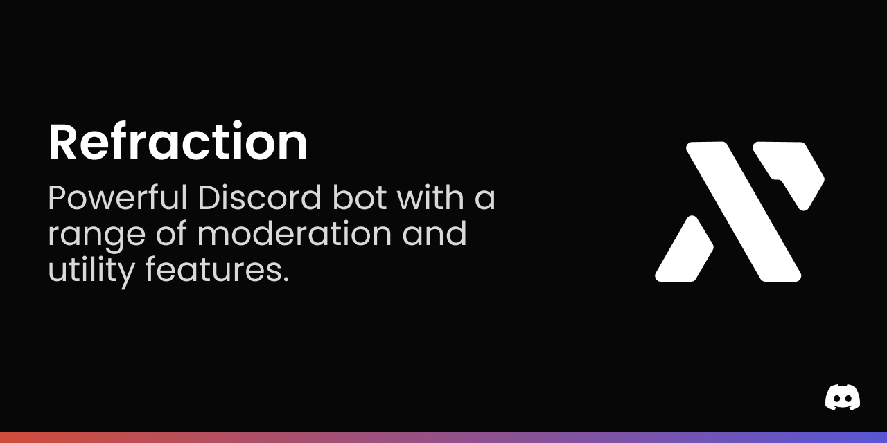

## Refraction

Refraction is a powerful Discord bot with a range of moderation and utility features. With Refraction, you can easily manage your server, enforce rules, and provide helpful tools for your users. Some of Refraction's features include:

- Moderation tools such as mute, kick, and ban
- Customizable welcome and goodbye messages
- Automatic message deletion and filtering
- Role management and assignment
- Server backups and server stats

Getting Started

To add Refraction to your Discord server, simply follow these steps:

- Invite the bot to your server using this link: [INSERT INVITE LINK HERE]
- Use the `/set` slash command to configure the bot's settings for your server.
- Enjoy all the great features that Refraction has to offer!

## Support

If you have any issues or questions about Refraction, please don't hesitate to reach out to us. You can contact us through the following channels:

- Email: km127pl [at] gmail [dot] com
- Discord: [Support Server](https://refraction.us.to/support?src=readme)

We are always happy to help and will do our best to resolve any issues you may have.

## License

Refraction is licensed under the GNU AGPL license. For more information, see the [LICENSE](LICENSE) file.
## Credits

Refraction was developed by km127pl with the help of the following open source projects:

[INSERT OPEN SOURCE PROJECT NAME HERE](https://example.com)

We are grateful to the developers of these projects for their contributions and support.